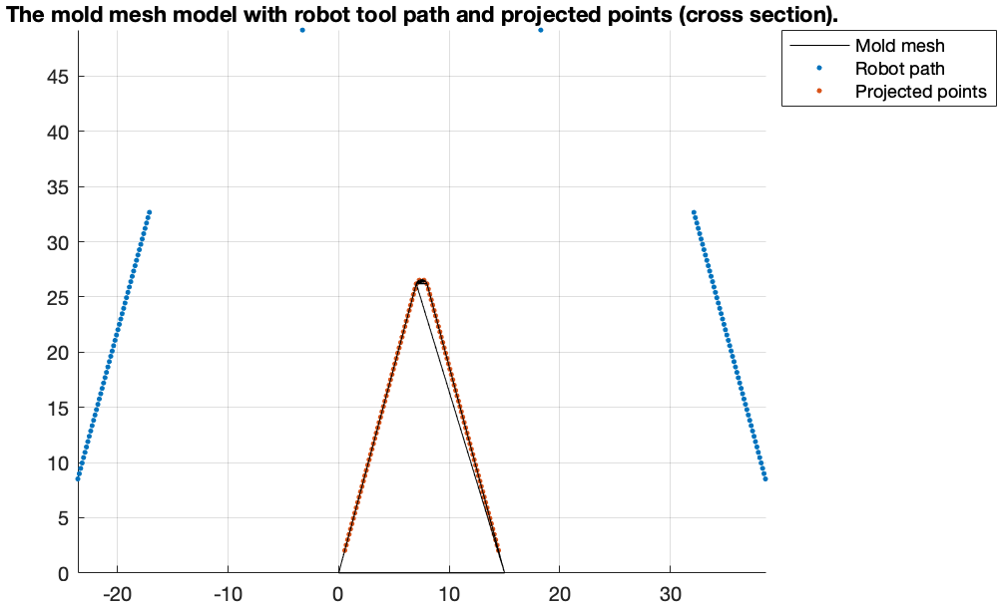

# Cold Spray Deposition Simulation
The simulation followed the method proposed in Nault et al. *Multi-axis tool path optimization and deposition modeling for cold spray additive manufacturing*.

## How to run?
Run *simulation.m* in matlab

## Method

### Deposition Modeling

The method assume that the deposition follows a Gaussian distribution.

It then used the assumption to "grow" the points of meshes of the model.

### Assumption (for now)
1. The robot motions are moveL with constant speed.
2. All part of molds are below the nozzle. (Holds for a small mold but probably not big object like a blade.)

## Result

### The mold

The test mold looks like below

### Simulation Result with Robot path

Robot path and mesh (cross section)

Simulation result

Calculation time

Mean: 7.23e-04
Std: 0.0022

